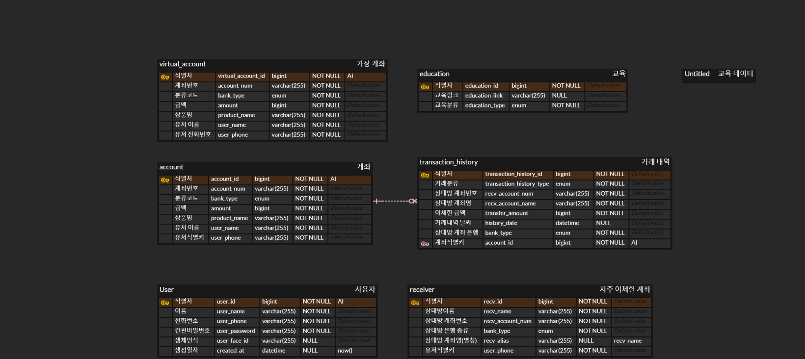

# README.md

# 🤵 Sinbi - 노년층을 위한 AI 비서 서비스


## Sinbi 링크 : https://sinbi.life/

---

## 1️⃣ 프로젝트 개요

⏳ **개발 기간**
2024.08.26 ~ 2024.10.11 (7주)
---

👨‍👨‍👦‍👦 **팀원 소개**
---

| **안진우(팀장) [FE]**        | **김희주 [FE]**               | **김시온 [INFRA]**            |
| -------------------------------------------------------------- | ------------------------------------------------------------------------------------ | --------------------------------------------------------------------- |
|  |  |  |
| 팀장 <br> 디자인 <br>          | AI <br> Notion 정리 <br> 커서 공유 <br> 공유 마커   | 인프라 담당 <br> 아키텍쳐 설계 <br> K8S <br> GitOps |

| **이정하 [FE]**         | **이학현 [BE]**                    | **지민경 [AI]**                          |
| -------------------------------------------------------------- | ------------------------------------------------------------------------------------ | --------------------------------------------------------------------- |
|   |  |  |
| 채팅 구현 <br> 공유 마커 <br> DB 설계 <br> jwt 로그인          | <br> UCC 제작 <br> 무중단 배포 <br> 채널 crud <br> test 코드 작성 <br> openvidu 세팅 | api 설계 및 구현<br> 피드 채널 <br> 정보 채널 <br> 발표 및 ppt 제작   |


📕 **기획 의도**
---

“Sinbi”는 어르신 비서의 줄임말로, 디지털에 익숙하지 않은 노년층을 위한 AI 기반 포용적 금융 서비스 플랫폼입니다. 이 서비스는 노령층의 디지털 금융 접근성을 높이고, 복잡한 금융 과정을 음성을 통해 쉽게 이용할 수 있도록 돕는 것을 목표로 합니다.

“Sinbi”는 음성 인식 기술을 이용하여 계좌 조회, 송금, 금융 상품 조회 등 기본적인 금융 서비스를 음성으로 간편하게 제공합니다. 또한, 금융 사기 예방 교육과 금융 관련 최신 뉴스를 음성으로 전달하며, 사용자가 이해하기 쉽게 설명하는 기능을 포함하고 있습니다. 노년층이 디지털 금융에 대한 두려움을 줄이고, 독립적으로 금융 업무를 처리할 수 있도록 AI 비서의 역할을 수행합니다.

궁극적으로 이 프로젝트는 사용자들이 자신들의 금융 생활을 더욱 독립적이고 안전하게 관리할 수 있도록 지원하며, 사용자의 삶에 금융적 안정과 자신감을 더해주는 것을 목표로 하고 있습니다. Sinbi를 통해 노년층도 스마트하고 안전하게 금융 생활을 즐길 수 있도록 돕고자 합니다.

💭 **목표**
---
- 사용자 중심 경험 제공
  - 직관적이고 사용하기 쉬운 인터페이스 설계를 통해 노년층 사용자가 디지털 금융을 더 쉽게 접근할 수 있도록 지원
  - 개인화된 AI 금융 도우미 서비스를 제공하여 사용자가 자신의 금융 상황에 맞춘 도움을 받을 수 있도록 함
- 생성형 AI 기술 활용
  - 최신 음성 인식 및 자연어 처리 기술을 활용하여 사용자의 음성을 정확하게 인식하고, 맥락에 맞는 금융 정보를 제공
  - 단순 명령어뿐 아니라 대화형 인터페이스를 통해 사용자가 금융 거래를 더욱 직관적으로 이해할 수 있도록 지원

---

## 2️⃣ 서비스 소개

### 1. 메인페이지

✔️ 메인 페이지 기능/모바일

​ ✔️ 진행중인 워케이션

​ ✔️ 워케이션 효과 및 경제적 파급효과


### 2. 회원가입 및 로그인

​ ✔️ 회원 가입 및 로그인 기능 /모바일

​ ✔️ 지역 선택


### 3. 대시보드

​ ✔️ 대시보드 기능/모바일

​ ✔️ 일정 관리

​ ✔️ AI 일정 리마인드


### 4. 내 채널

​ ✔️ 내 채널 기능/모바일

​ ✔️ 피드 작성/삭제

​ ✔️ 프로필 사진 변경


### 5. 정보 채널

​ ✔️ 정보 채널 기능/모바일

​ ✔️ 다양한 피드 보기/작성/삭제


### 6. 모임 채널

​ ✔️ 모임 채널 기능/모바일

​ ✔️ 모임 채널 생성/삭제

​ ✔️ 모임 채널 보기


### 7. 모임채널 - 공유지도

​ ✔️ 공유 지도 기능/모바일

​ ✔️ 공유 지도 검색


### 8. 모임 채널 - 채팅 및 영상 통화

​ ✔️ 기능/모바일

​ ✔️ 채팅 및 영상 통화


---

## 3️⃣ 기술 스택

## 🌝 사용된 도구

- React 18.3.1
- Typescript
- Three.js
- Spring Boot 3.3.2
- spring Data JPA
- swagger(Spring docs)
- spring security
- JWT
- Spring Cloud Config
- java 17
- Gradle 8.8
- IDE: Visual Studio Code 1.48, IntelliJ IDEA 2024.1.1 (Ultimate Edition)
- GitLab
- Jira
- Discord
- K8S
- Kafka
- Jenkins
- EC2
- S3
- MySQL
- MongoDB
- Server API(Ingress Controller)
- pytorch
- flask

## 🌝 사용된 기술

### 🌞 [FE]

  

---
### 🌚 [BE]

 
 

 

 
 

 
 


---
---
### 🌝 [Infra]

 
 
 
 


## 🌝[기술]


**[ BACK END ]**

- **Spring Security** : SecurityFilterChain을 사용하여 사용자 인증과 권한에 따라 인가 기능을 구현.
- **JWT** : JSON Web Token을 활용하여 안전한 사용자 인증 및 정보 교환을 구현.
- **Spring Data JAP** : 데이터베이스와의 통신을 위해 JPA를 사용해 간편한 CRUD 기능 및 쿼리 최적화를 제공.
- **Spring Cloud Config** : 분산 환경에서 중앙화된 설정 관리와 버전 관리를 통해 서비스의 일관성을 유지.
- **MySQL** : 회원 정보, 금융 기록 등 주요 데이터를 저장하는 데 사용.
- **Redis** : 비정형 데이터를 저장하기 위해 NoSQL 데이터베이스로 사용.
- **Pytorch** : 머신러닝 모델 구현과 학습을 위해 사용.
- **Flask** : 간단한 RESTful API 서버나 머신러닝 모델의 서빙을 위해 Python 기반의 마이크로 웹 프레임워크로 사용.

**[ FRONT END ]**

- **React** : 컴포넌트 기반의 사용자 인터페이스를 구축하기 위한 JavaScript 라이브러리.
- **TypeScript** : JavaScript의 슈퍼셋으로, 정적 타입을 사용해 더 안정적이고 유지보수하기 쉬운 코드를 작성.
- **Three.js** : WebGL을 사용하여 3D 그래픽과 애니메이션을 구현하는 JavaScript 라이브러리.
- **PWA (Progressive Web App)** : 매니페스트 파일을 이용하여 사용자가 웹 앱을 모바일 기기에 설치할 수 있도록 지원.

**[ INFRA ]**
- **Kubernetes(K8S)** : 컨테이너 오케스트레이션을 통해 애플리케이션의 배포, 확장 및 관리를 자동화하여 서비스의 신뢰성과 확장성을 높임.
- **Docker & Docker Compose** : 애플리케이션을 컨테이너화하여 이식성을 높였으며, Docker Compose를 사용하여 다중 컨테이너 애플리케이션 관리.
- **AWS**
  - **EC2** : 애플리케이션 서버를 호스팅하고 배포하는 데 사용하여 클라우드 기반의 확장 가능성과 안정성을 제공.
  - **S3** : 정적 파일과 사용자 콘텐츠 저장을 위한 안전한 스토리지로 사용.
- **Jenkins** : 지속적 통합 및 지속적 배포(CI/CD)를 자동화하여 개발과 배포의 일관성과 신속성을 보장.
- **Ingress Controller** : Nginx 기반으로 클러스터 외부의 요청을 내부 서비스로 라우팅하여 부하 분산 및 리버스 프록시 역할 수행.
- **GitLab** : 코드 버전 관리와 협업을 위한 Git 저장소로 사용, CI/CD 파이프라인 구축에 활용.
- **Gradle** : 프로젝트 빌드 및 의존성 관리를 통해 백엔드 애플리케이션의 효율적인 빌드 프로세스 제공.
- **Redis** : 인메모리 데이터 저장소로, 캐싱을 통해 데이터 조회 속도를 향상시키고 세션 관리와 메시지 큐 등에 사용하여 시스템 성능 최적화.

**[ TEAM Cooperation ]**

- **GitLab** : GitLab을 활용하여 프로젝트를 관리.
  - Git Flow 에 따른 브랜치 전략 수립.
  - MR 시 코드 리뷰 진행.
- **Jira** : 이슈 관리 도구로 활용.
  - 주요 기능들을 이슈로 등록하고 Story Point를 산정한 후, 담당자를 지정하여 프로젝트를 진행.
  - 1~2 주 정도 상황에 맞게 스프린트를 설정.

## 🌝 시스템 아키텍쳐


## 🌝 ERD



---

## 🌝 폴더 구조

### 🌞[FE]

```
📦src
 ┣ 📂assets
 ┃ ┣ 📂logoSVG
 ┃ ┃ ┣ 📜btn_apple.svg
 ┃ ┃ ┣ 📜btn_gmail.svg
 ┃ ┃ ┣ 📜btn_google.svg
 ┃ ┃ ┣ 📜btn_kakao.svg
 ┃ ┃ ┗ 📜btn_naver.svg
 ┃ ┣ 📜404.png
 ┃ ┣ 📜500.png
 ┃ ┣ 📜back.svg
 ┃ ┣ 📜background.svg
 ┃ ┣ 📜censoredImg.png
 ┃ ┣ 📜detailBG.jpg
 ┃ ┣ 📜icons.jsx
 ┃ ┣ 📜img_generator.png
 ┃ ┣ 📜login.svg
 ┃ ┣ 📜logout.svg
 ┃ ┣ 📜react.svg
 ┃ ┣ 📜send.svg
 ┃ ┗ 📜user.svg
 ┣ 📂components
 ┃ ┣ 📜Button.jsx
 ┃ ┗ 📜NavigationBar.jsx
 ┣ 📂pages
 ┃ ┣ 📂DreamPage
 ┃ ┃ ┣ 📂components
 ┃ ┃ ┃ ┣ 📜ContentBox.jsx
 ┃ ┃ ┃ ┣ 📜DatePicker.jsx
 ┃ ┃ ┃ ┣ 📜ImageGenerator.jsx
 ┃ ┃ ┃ ┣ 📜InterpretationBox.jsx
 ┃ ┃ ┃ ┣ 📜ShareSettings.jsx
 ┃ ┃ ┃ ┗ 📜UpperBar.jsx
 ┃ ┃ ┣ 📜DreamDetailPage.jsx
 ┃ ┃ ┗ 📜DreamRegisterPage.jsx
 ┃ ┣ 📂LoginPage
 ┃ ┃ ┣ 📂components
 ┃ ┃ ┃ ┣ 📜FadeInText.jsx
 ┃ ┃ ┃ ┗ 📜LoginSuccess.jsx
 ┃ ┃ ┗ 📜LoginPage.jsx
 ┃ ┣ 📂SkeletonPage
 ┃ ┃ ┣ 📂components
 ┃ ┃ ┃ ┗ 📜SkeletonBlock.jsx
 ┃ ┃ ┣ 📜SquareDetailSkeletonPage.jsx
 ┃ ┃ ┣ 📜SquareSkeletonPage.jsx
 ┃ ┃ ┗ 📜StatisticsSkeletonPage.jsx
 ┃ ┣ 📂StreamingPage
 ┃ ┃ ┣ 📂components
 ┃ ┃ ┃ ┣ 📂legacy
 ┃ ┃ ┃ ┃ ┣ 📜StreamingList_WebRTC.jsx
 ┃ ┃ ┃ ┃ ┗ 📜StreamingRoom_WebRTC.jsx
 ┃ ┃ ┃ ┣ 📜StreamingList.jsx
 ┃ ┃ ┃ ┗ 📜StreamingRoom.jsx
 ┃ ┃ ┗ 📜StreamingPage.jsx
 ┃ ┣ 📜ErrorPage.jsx
 ┃ ┣ 📜MainPage.jsx
 ┃ ┣ 📜SettingsPage.jsx
 ┃ ┣ 📜SquareDetailPage.jsx
 ┃ ┣ 📜SquarePage.jsx
 ┃ ┗ 📜StatisticsPage.jsx
 ┣ 📂recoil
 ┃ ┗ 📜atoms.js
 ┣ 📂utils
 ┃ ┣ 📜api.js
 ┃ ┣ 📜firebase.js
 ┃ ┗ 📜utils.js
 ┣ 📜App.jsx
 ┣ 📜index.css
 ┗ 📜main.jsx
```

### 🌚[BE]

```
📦domain
 ┣ 📂api
 ┃ ┣ 📂controller
 ┃ ┃ ┗ 📜ImageController.java
 ┃ ┣ 📂dto
 ┃ ┃ ┣ 📜Translation.java
 ┃ ┃ ┣ 📜TranslationRequest.java
 ┃ ┃ ┗ 📜TranslationResponse.java
 ┃ ┗ 📂service
 ┃ ┃ ┣ 📜ImageService.java
 ┃ ┃ ┗ 📜NovitaAiService.java
 ┣ 📂aws
 ┃ ┣ 📜FileController.java
 ┃ ┗ 📜S3UploadService.java
 ┣ 📂config
 ┃ ┣ 📜AuditConfig.java
 ┃ ┣ 📜BeanConfig.java
 ┃ ┣ 📜CorsMvcConfig.java
 ┃ ┣ 📜DeepLConfig.java
 ┃ ┣ 📜FilterConfig.java
 ┃ ┣ 📜FirebaseConfig.java
 ┃ ┣ 📜S3Config.java
 ┃ ┣ 📜SchedulingConfig.java
 ┃ ┣ 📜SecurityConfig.java
 ┃ ┗ 📜SwaggerConfig.java
 ┣ 📂entity
 ┃ ┣ 📂category
 ┃ ┃ ┣ 📂controller
 ┃ ┃ ┃ ┗ 📜CategoryController.java
 ┃ ┃ ┣ 📂dto
 ┃ ┃ ┃ ┣ 📜CategoryResponseDto.java
 ┃ ┃ ┃ ┣ 📜CommonResponseDto.java
 ┃ ┃ ┃ ┣ 📜DreamTypeCountDto.java
 ┃ ┃ ┃ ┗ 📜ObjectResponseDto.java
 ┃ ┃ ┣ 📂repository
 ┃ ┃ ┃ ┗ 📜CategoryRepository.java
 ┃ ┃ ┣ 📂service
 ┃ ┃ ┃ ┗ 📜CategoryService.java
 ┃ ┃ ┣ 📜Category.java
 ┃ ┃ ┗ 📜Type.java
 ┃ ┣ 📂comment
 ┃ ┃ ┣ 📂controller
 ┃ ┃ ┃ ┗ 📜CommentController.java
 ┃ ┃ ┣ 📂dto
 ┃ ┃ ┃ ┣ 📜CommentRequest.java
 ┃ ┃ ┃ ┣ 📜CommentResponse.java
 ┃ ┃ ┃ ┗ 📜CommentUpdateLikesDto.java
 ┃ ┃ ┣ 📂repository
 ┃ ┃ ┃ ┗ 📜CommentRepository.java
 ┃ ┃ ┣ 📂service
 ┃ ┃ ┃ ┗ 📜CommentService.java
 ┃ ┃ ┗ 📜Comment.java
 ┃ ┣ 📂commentlike
 ┃ ┃ ┣ 📂repository
 ┃ ┃ ┃ ┗ 📜CommentLikeRepository.java
 ┃ ┃ ┗ 📜CommentLike.java
 ┃ ┣ 📂common
 ┃ ┃ ┣ 📜ApiResponse.java
 ┃ ┃ ┗ 📜BaseTimeEntity.java
 ┃ ┣ 📂dream
 ┃ ┃ ┣ 📂controller
 ┃ ┃ ┃ ┣ 📜DreamController.java
 ┃ ┃ ┃ ┗ 📜SquareController.java
 ┃ ┃ ┣ 📂dto
 ┃ ┃ ┃ ┣ 📜DreamCategoryDto.java
 ┃ ┃ ┃ ┣ 📜DreamCreateRequest.java
 ┃ ┃ ┃ ┣ 📜DreamDto.java
 ┃ ┃ ┃ ┣ 📜DreamGetResponse.java
 ┃ ┃ ┃ ┣ 📜DreamMainRequest.java
 ┃ ┃ ┃ ┣ 📜DreamMainResponse.java
 ┃ ┃ ┃ ┣ 📜DreamMainResponseWithCount.java
 ┃ ┃ ┃ ┣ 📜DreamUpdateLikesDto.java
 ┃ ┃ ┃ ┣ 📜DreamUpdateRequest.java
 ┃ ┃ ┃ ┣ 📜SquareDetailResponse.java
 ┃ ┃ ┃ ┗ 📜SquareGetResponseDto.java
 ┃ ┃ ┣ 📂repository
 ┃ ┃ ┃ ┗ 📜DreamRepository.java
 ┃ ┃ ┣ 📂service
 ┃ ┃ ┃ ┣ 📜DreamService.java
 ┃ ┃ ┃ ┗ 📜SquareService.java
 ┃ ┃ ┗ 📜Dream.java
 ┃ ┣ 📂dreamcategory
 ┃ ┃ ┣ 📂repository
 ┃ ┃ ┃ ┗ 📜DreamCategoryRepository.java
 ┃ ┃ ┗ 📜DreamCategory.java
 ┃ ┣ 📂notification
 ┃ ┃ ┣ 📂controller
 ┃ ┃ ┃ ┗ 📜NotificationController.java
 ┃ ┃ ┣ 📂dto
 ┃ ┃ ┃ ┗ 📜NotificationRequest.java
 ┃ ┃ ┣ 📂repository
 ┃ ┃ ┃ ┗ 📜NotificationRepository.java
 ┃ ┃ ┣ 📂scheduler
 ┃ ┃ ┃ ┗ 📜NotificationScheduler.java
 ┃ ┃ ┣ 📜Notification.java
 ┃ ┃ ┗ 📜NotificationType.java
 ┃ ┣ 📂room
 ┃ ┃ ┣ 📂controller
 ┃ ┃ ┃ ┗ 📜RoomController.java
 ┃ ┃ ┣ 📂dto
 ┃ ┃ ┃ ┗ 📜RoomListResponse.java
 ┃ ┃ ┣ 📂repository
 ┃ ┃ ┃ ┗ 📜RoomRepository.java
 ┃ ┃ ┣ 📂service
 ┃ ┃ ┃ ┗ 📜RoomService.java
 ┃ ┃ ┗ 📜Room.java
 ┃ ┗ 📂user
 ┃ ┃ ┣ 📂controller
 ┃ ┃ ┃ ┣ 📜AuthController.java
 ┃ ┃ ┃ ┣ 📜MainController.java
 ┃ ┃ ┃ ┣ 📜MyController.java
 ┃ ┃ ┃ ┗ 📜UserController.java
 ┃ ┃ ┣ 📂dto
 ┃ ┃ ┃ ┣ 📜UpdateNicknameRequest.java
 ┃ ┃ ┃ ┣ 📜UserDto.java
 ┃ ┃ ┃ ┗ 📜UserInfoResponse.java
 ┃ ┃ ┣ 📂repository
 ┃ ┃ ┃ ┗ 📜UserRepository.java
 ┃ ┃ ┣ 📂service
 ┃ ┃ ┃ ┗ 📜UserService.java
 ┃ ┃ ┣ 📜Role.java
 ┃ ┃ ┗ 📜User.java
 ┣ 📂exception
 ┃ ┣ 📂global
 ┃ ┃ ┗ 📜ControllerExceptionAdvice.java
 ┃ ┣ 📜BadRequestException.java
 ┃ ┣ 📜ForbiddenException.java
 ┃ ┣ 📜InvalidCommentException.java
 ┃ ┣ 📜InvalidDreamException.java
 ┃ ┣ 📜InvalidUserException.java
 ┃ ┣ 📜NicknameAlreadyExistsException.java
 ┃ ┣ 📜NotFoundException.java
 ┃ ┣ 📜RoomNotFoundException.java
 ┃ ┣ 📜ServerErrorException.java
 ┃ ┣ 📜UnauthenticatedException.java
 ┃ ┗ 📜UserNotFoundException.java
 ┣ 📂fcm
 ┃ ┗ 📜FcmService.java
 ┣ 📂jwt
 ┃ ┣ 📜JWTFilter.java
 ┃ ┗ 📜JWTUtil.java
 ┣ 📂oauth
 ┃ ┣ 📂dto
 ┃ ┃ ┣ 📜CustomOAuth2User.java
 ┃ ┃ ┣ 📜GoogleResponse.java
 ┃ ┃ ┣ 📜KakaoResponse.java
 ┃ ┃ ┣ 📜NaverResponse.java
 ┃ ┃ ┗ 📜OAuth2Response.java
 ┃ ┣ 📂factory
 ┃ ┃ ┣ 📜GoogleResponseFactory.java
 ┃ ┃ ┣ 📜KakaoResponseFactory.java
 ┃ ┃ ┣ 📜NaverResponseFactory.java
 ┃ ┃ ┗ 📜OAuth2ResponseFactory.java
 ┃ ┣ 📂handler
 ┃ ┃ ┗ 📜CustomSuccessHandler.java
 ┃ ┗ 📂service
 ┃ ┃ ┗ 📜CustomOAuth2UserService.java
 ┗ 📂socket
 ┃ ┣ 📜ChatMessage.java
 ┃ ┣ 📜SocketIoConfig.java
 ┃ ┣ 📜SocketIOEventHandler.java
 ┃ ┗ 📜SocketIOServerRunner.java
```
