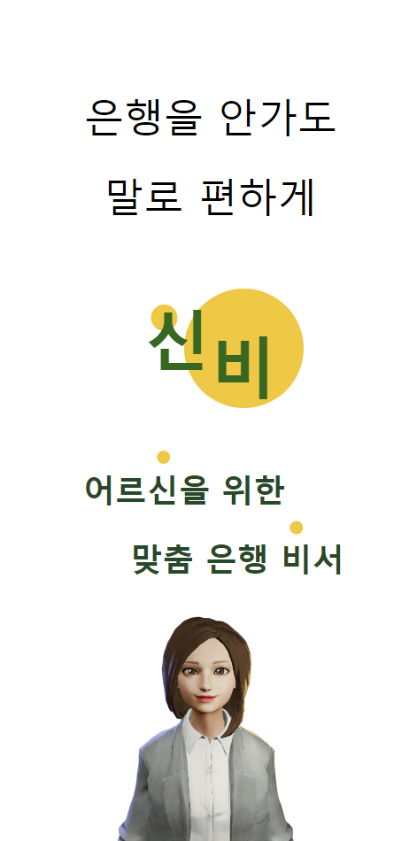
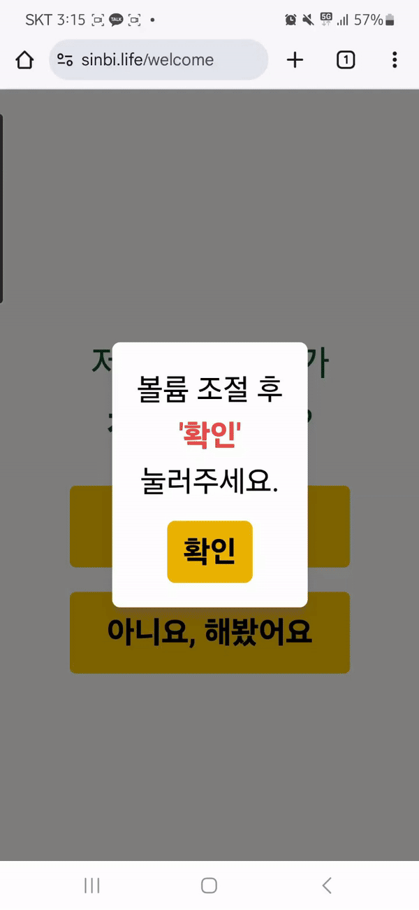
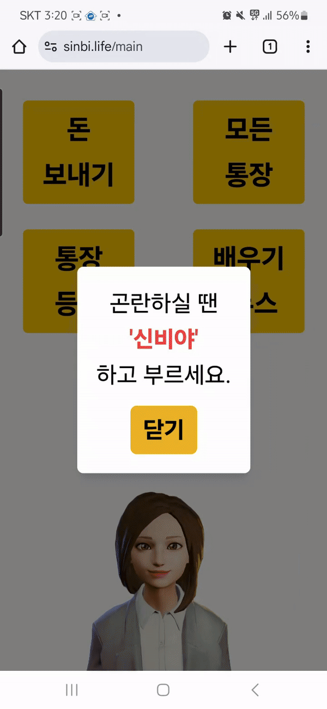
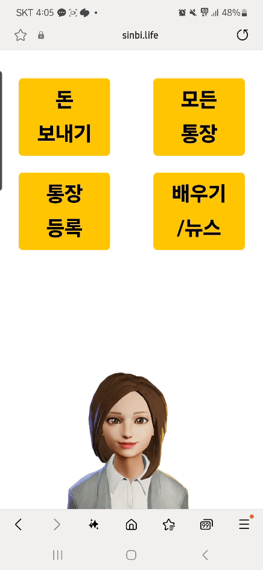
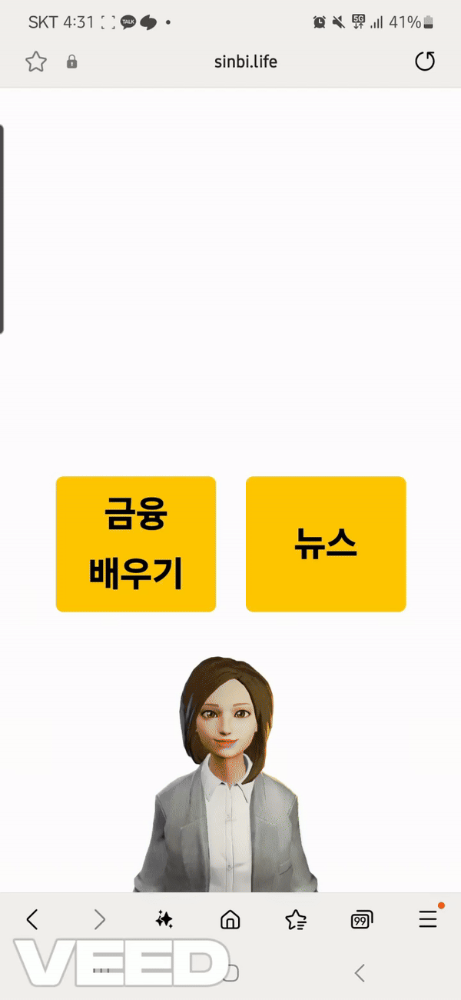
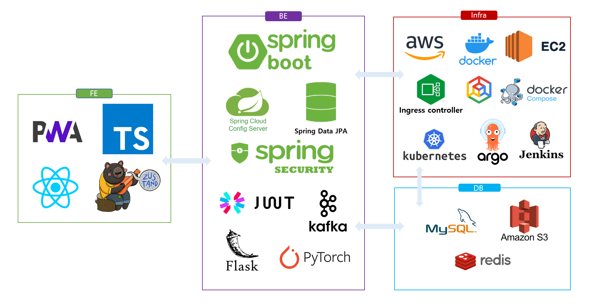
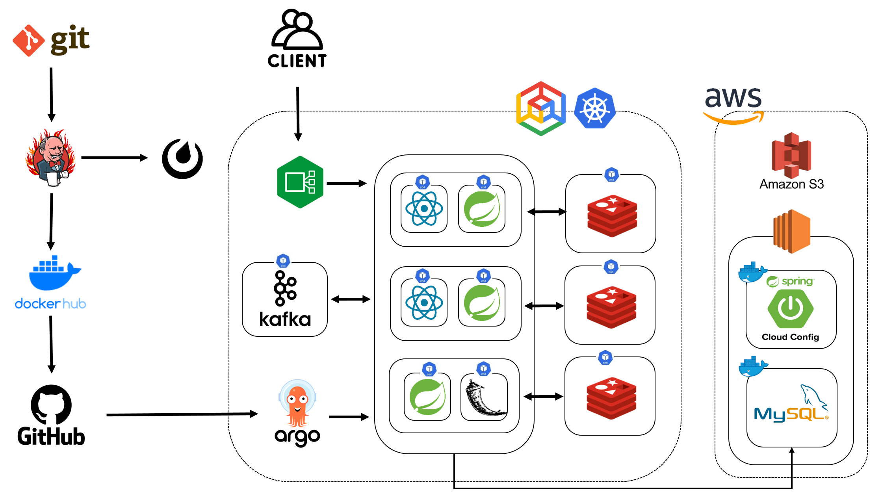

# README.md

# 🤵 Sinbi - 노년층을 위한 AI 비서 서비스



## Sinbi 링크 : https://sinbi.life/

---

## 1️⃣ 프로젝트 개요

⏳ **개발 기간**
2024.08.26 ~ 2024.10.11 (7주)
---

👨‍👨‍👦‍👦 **팀원 소개**
---

| **안진우(팀장) [BE]**                                          | **김희주 [FE]**                                                                      | **김시온 [INFRA]**                                                    |
| -------------------------------------------------------------- | ------------------------------------------------------------------------------------ | --------------------------------------------------------------------- |
|  |  |  |
| 팀장 <br> SpringCloudConfig <br> Security <br> JWT <br> Kafka | 계좌 조회 <br> 계좌 등록 <br> 계좌 이체 <br> tts/stt | 인프라 담당 <br> 아키텍쳐 설계 <br> K8S <br> GitOps |


| **이정하 [FE]**                                                | **이학현 [BE]**                                                                      | **지민경 [AI/데이터 시각화]**                                               |
| -------------------------------------------------------------- | ------------------------------------------------------------------------------------ | --------------------------------------------------------------------- |
|   |  |  |
| 회원가입 <br> 로그인 <br> 배우기 <br> 뉴스 페이지          | Kafka 기능 적용 <br> MSA 설계 <br> SAGA 패턴 적용 <br> 문서화 | T5 기반 방언 데이터 학습 모델 <br> T5-Text summary <br> Sentence-Bert <br> Mecab <br> Okt <br> Flask API  <br> Redis  <br> BeautifulSoup |


📕 **기획 의도**
---

“Sinbi”는 어르신 비서의 줄임말로, 디지털에 익숙하지 않은 노년층을 위한 AI 기반 포용적 금융 서비스 플랫폼입니다. 이 서비스는 노령층의 디지털 금융 접근성을 높이고, 복잡한 금융 과정을 음성을 통해 쉽게 이용할 수 있도록 돕는 것을 목표로 합니다.

“Sinbi”는 음성 인식 기술을 이용하여 계좌 조회, 송금, 금융 상품 조회 등 기본적인 금융 서비스를 음성으로 간편하게 제공합니다. 또한, 금융 사기 예방 교육과 금융 관련 최신 뉴스를 음성으로 전달하며, 사용자가 이해하기 쉽게 설명하는 기능을 포함하고 있습니다. 노년층이 디지털 금융에 대한 두려움을 줄이고, 독립적으로 금융 업무를 처리할 수 있도록 AI 비서의 역할을 수행합니다.

궁극적으로 이 프로젝트는 사용자들이 자신들의 금융 생활을 더욱 독립적이고 안전하게 관리할 수 있도록 지원하며, 사용자의 삶에 금융적 안정과 자신감을 더해주는 것을 목표로 하고 있습니다. Sinbi를 통해 노년층도 스마트하고 안전하게 금융 생활을 즐길 수 있도록 돕고자 합니다.

💭 **목표**
---
- 사용자 중심 경험 제공
  - 직관적이고 사용하기 쉬운 인터페이스 설계를 통해 노년층 사용자가 디지털 금융을 더 쉽게 접근할 수 있도록 지원
  - 개인화된 AI 금융 도우미 서비스를 제공하여 사용자가 자신의 금융 상황에 맞춘 도움을 받을 수 있도록 함
- 생성형 AI 기술 활용
  - 최신 음성 인식 및 자연어 처리 기술을 활용하여 사용자의 음성을 정확하게 인식하고, 맥락에 맞는 금융 정보를 제공
  - 단순 명령어뿐 아니라 대화형 인터페이스를 통해 사용자가 금융 거래를 더욱 직관적으로 이해할 수 있도록 지원

---

## 2️⃣ 서비스 소개

### 1. 회원가입/로그인

✔️ 회원가입/로그인

​ ✔️ 음성 가이드를 통한 회원가입

​ ✔️ SMS 인증을 통한 회원가입

​ ✔️ 전화번호로 로그인

​ ✔️ 얼굴 인증을 통한 로그인



### 2. 통장 등록

​ ✔️ 음성 인식을 통한 통장 등록




### 3. 돈 보내기

​ ✔️ 음성 인식을 통한 돈 보내기

​ ✔️ 자주 거래 하는 상대방 통장 등록하기


### 4. 모든 통장

​ ✔️ 등록된 모든 통장을 조회



### 5. 뉴스/배우기

​ ✔️ AI를 통해 최신 뉴스 크롤링 및 요약

​ ✔️ 음성으로 뉴스를 읽어드림

​ ✔️ 배우기를 통해 금융 상식을 배울 수 있음



---

## 3️⃣ 기술 스택

## 🌝 사용된 도구

- React 18.3.1
- Typescript
- Three.js
- Spring Boot 3.3.2
- spring Data JPA
- spring security
- JWT
- Spring Cloud Config
- java 17
- Gradle 8.8
- IDE: Visual Studio Code 1.48, IntelliJ IDEA 2024.1.1 (Ultimate Edition)
- GitLab
- Jira
- Discord
- pytorch
- flask
- EC2
- GCP
- S3
- K8S
- Jenkins
- Argo
- Docker
- Nginx Ingress Controller
- MySQL
- Redis
- Mattermost Notification
- Kafka
- Kafka-ui
- Helm
- S3
- DockerHub
- Zustand


## 🌝 사용된 기술

### 🌞 [FE]

  


---
### 🌚 [BE]

 
 

 

 
 

 
 


---
---
### 🌝 [Infra]

 
 
 
 


## 🌝[기술]


**[ BACK END ]**

- **Spring Security** : SecurityFilterChain을 사용하여 사용자 인증과 권한에 따라 인가 기능을 구현.
- **JWT** : JSON Web Token을 활용하여 안전한 사용자 인증 및 정보 교환을 구현.
- **Spring Data JAP** : 데이터베이스와의 통신을 위해 JPA를 사용해 간편한 CRUD 기능 및 쿼리 최적화를 제공.
- **Spring Cloud Config** : 분산 환경에서 중앙화된 설정 관리와 버전 관리를 통해 서비스의 일관성을 유지.
- **MySQL** : 회원 정보, 금융 기록 등 주요 데이터를 저장하는 데 사용.
- **Pytorch** : 머신러닝 모델 구현과 학습을 위해 사용.
- **Flask** : 간단한 RESTful API 서버나 머신러닝 모델의 서빙을 위해 Python 기반의 마이크로 웹 프레임워크로 사용.

**[ FRONT END ]**

- **React** : 컴포넌트 기반의 사용자 인터페이스를 구축하기 위한 JavaScript 라이브러리.
- **TypeScript** : JavaScript의 슈퍼셋으로, 정적 타입을 사용해 더 안정적이고 유지보수하기 쉬운 코드를 작성.
- **Three.js** : WebGL을 사용하여 3D 그래픽과 애니메이션을 구현하는 JavaScript 라이브러리.
- **PWA (Progressive Web App)** : 매니페스트 파일을 이용하여 사용자가 웹 앱을 모바일 기기에 설치할 수 있도록 지원.
- **Zustand** : 경량 상태 관리 라이브러리로, React 애플리케이션에서의 전역 상태 관리를 간편하게 지원.

**[ INFRA ]**
- **Kubernetes(K8S)** : 컨테이너 오케스트레이션을 통해 애플리케이션의 배포, 확장 및 관리를 자동화하여 서비스의 신뢰성과 확장성을 높임.
- **Docker & Docker Compose** : 애플리케이션을 컨테이너화하여 이식성을 높였으며, Docker Compose를 사용하여 다중 컨테이너 애플리케이션 관리.
- **AWS**
  - **EC2** : 애플리케이션 서버를 호스팅하고 배포하는 데 사용하여 클라우드 기반의 확장 가능성과 안정성을 제공.
  - **S3** : 정적 파일과 사용자 콘텐츠 저장을 위한 안전한 스토리지로 사용.
- **Jenkins** : 지속적 통합 및 지속적 배포(CI/CD)를 자동화하여 개발과 배포의 일관성과 신속성을 보장.
- **Ingress Controller** : Nginx 기반으로 클러스터 외부의 요청을 내부 서비스로 라우팅하여 부하 분산 및 리버스 프록시 역할 수행.
- **GitLab** : 코드 버전 관리와 협업을 위한 Git 저장소로 사용, CI/CD 파이프라인 구축에 활용.
- **Gradle** : 프로젝트 빌드 및 의존성 관리를 통해 백엔드 애플리케이션의 효율적인 빌드 프로세스 제공.
- **Redis** : 인메모리 데이터 저장소로, 캐싱을 통해 데이터 조회 속도를 향상시키고 세션 관리와 메시지 큐 등에 사용하여 시스템 성능 최적화.
- **Google Kubernetes Engine (GKE)** : Google Cloud에서 Kubernetes 클러스터를 관리하고 배포할 수 있는 서비스로, 인프라의 안정성과 확장성을 지원.
- **Argo** : Kubernetes 클러스터에서 워크플로우를 자동화하고 관리하는 도구로, CI/CD 및 배포 파이프라인 구축에 활용.

**[ TEAM Cooperation ]**

- **GitLab** : GitLab을 활용하여 프로젝트를 관리.
  - Git Flow 에 따른 브랜치 전략 수립.
  - MR 시 코드 리뷰 진행.
- **Jira** : 이슈 관리 도구로 활용.
  - 주요 기능들을 이슈로 등록하고 Story Point를 산정한 후, 담당자를 지정하여 프로젝트를 진행.
  - 1~2 주 정도 상황에 맞게 스프린트를 설정.

## 🌝 시스템 아키텍쳐



## 🌝 ERD


---

## 🌝 폴더 구조

## 🌞[FE]

```
📦src
 ┣ 📂assets
 ┃ ┣ 📂audio
 ┃ ┃ ┣ 📜01_네_무엇을_도와드릴까요.mp3
 ┃ ┃ ┣ 📜02_원하는_기능을_말하거나_눌러주세요.mp3
 ┃ ┃ ┣ 📜03_다시_한_번_또박또박_말해주세요.mp3
 ┃ ┃ ┣ 📜04_다시_한_번_눌러주세요.mp3
 ┃ ┃ ┣ 📜05_뒤로_가려면_이전이라고_말해주세요.mp3
 ┃ ┃ ┣ 📜06_다음으로_넘어가려면_다음이라고_말해주세요.mp3
 ┃ ┃ ┣ 📜07_완료되었어요_시작화면으로_이동할게요.mp3
 ┃ ┃ ┣ 📜08_좋으면_응_싫으면_아니_라고_말해주세요.mp3
 ┃ ┃ ┣ 📜09_다_지워라고_말하면_전부_지울_수_있어요.mp3
 ┃ ┃ ┣ 📜10_'통장_등록'이라고_말하거나_눌러주세요.mp3
 ┃ ┃ ┣ 📜11_지금부터_통장_등록을_같이_시작해요_천천히_따라오세요.mp3
 ┃ ┃ ┣ 📜12_계좌번호를_말하거나_입력해주세요.mp3
 ┃ ┃ ┣ 📜13_은행을_말하거나_찾아서_눌러주세요.mp3
 ┃ ┃ ┣ 📜14_해당하는_계좌가_없어요_다시_한번_확인해주세요.mp3
 ┃ ┃ ┣ 📜15_이_계좌가_맞나요.mp3
 ┃ ┃ ┣ 📜16_인증번호를_보냈어요.mp3
 ┃ ┃ ┣ 📜17_통장_등록이_끝났어요_첫_화면으로_갈게요.mp3
 ┃ ┃ ┣ 📜18_새로운_계좌_버튼을_눌러주세요.mp3
 ┃ ┃ ┣ 📜19_'돈_보내기'라고_말하거나_눌러주세요.mp3
 ┃ ┃ ┣ 📜20_지금부터_돈_보내기를_같이_연습해요_걱정_마세요_가짜_돈이에요.mp3
 ┃ ┃ ┣ 📜21_새로운_계좌라고_말해주세요.mp3
 ┃ ┃ ┣ 📜22_어느_통장에서_돈을_보낼까요_하나를_골라_눌러주세요.mp3
 ┃ ┃ ┣ 📜23_연습으로_신비은행_일이삼_다시_일이_다시_삼사오육칠팔로_보내볼게요.mp3
 ┃ ┃ ┣ 📜24_만원이라고_한번_말해볼까요.mp3
 ┃ ┃ ┣ 📜25_얼마를_보낼지_말해주세요.mp3
 ┃ ┃ ┣ 📜26_자주_쓸_계좌면_응_이라고_말해주세요.mp3
 ┃ ┃ ┣ 📜27_응이라고_말해보세요.mp3
 ┃ ┃ ┣ 📜28_쉽게_기억할_이름을_정해요_작은_아들이라고_말해보세요.mp3
 ┃ ┃ ┣ 📜29_무슨_이름으로_기억할까요.mp3
 ┃ ┃ ┣ 📜30_자주_보내는_계좌로_가짜로_돈을_보내봐요.mp3
 ┃ ┃ ┣ 📜31_누구에게_보낼지_말하거나_눌러주세요_없으면_새로운_계좌라고_말하세요.mp3
 ┃ ┃ ┣ 📜32_아까_즐겨찾기에_저장한_작은_아들로_보내봐요_작은_아들이라고_말해보세요.mp3
 ┃ ┃ ┣ 📜33_성공적으로_돈을_보냈어요.mp3
 ┃ ┃ ┣ 📜34_돈_보내기_연습이_끝났어요_첫_화면으로_갈게요.mp3
 ┃ ┃ ┣ 📜35_모르는_사람에게_돈_보내면_위험해요.mp3
 ┃ ┃ ┣ 📜36_'모든_통장'이라고_말하거나_눌러주세요.mp3
 ┃ ┃ ┣ 📜37_지금부터_가지고_계신_통장을_모두_보여드릴게요.mp3
 ┃ ┃ ┣ 📜38_현재_가지고_계신_통장_목록이에요.mp3
 ┃ ┃ ┣ 📜39_자세히_볼_통장을_눌러주세요.mp3
 ┃ ┃ ┣ 📜40_이_통장의_모든_거래_내역이에요.mp3
 ┃ ┃ ┣ 📜41_지금부터_금융_배우기랑_뉴스_보러_가볼까요.mp3
 ┃ ┃ ┣ 📜42_금융_배우기라고_말해보세요.mp3
 ┃ ┃ ┣ 📜43_하나를_골라볼까요_금융_사기_예방이라고_말해보세요.mp3
 ┃ ┃ ┣ 📜44_금융_투자사기라고_말해보세요.mp3
 ┃ ┃ ┣ 📜45_이제_뉴스_기능을_배워봐요.mp3
 ┃ ┃ ┣ 📜46_뉴스라고_말해보세요.mp3
 ┃ ┃ ┣ 📜47_여기서는_뉴스를_요약해서_매일_들려드릴_거예요.mp3
 ┃ ┃ ┣ 📜48_배우기_끝_첫_화면으로_돌아갈게요.mp3
 ┃ ┃ ┣ 📜49_시작_화면으로_가고_싶으시면_시작_화면이라고_말해주세요.mp3
 ┃ ┃ ┣ 📜50_전화번호를_말하거나_입력해주세요.mp3
 ┃ ┃ ┣ 📜51_비밀번호_네_자리를_입력해주세요.mp3
 ┃ ┃ ┣ 📜52_얼굴로_로그인하면_더_편해요_얼굴을_등록할까요.mp3
 ┃ ┃ ┣ 📜53_얼굴을_인식할게요_눈_코_입을_화면에_맞춰주세요.mp3
 ┃ ┃ ┣ 📜54_저희_은행_비서가_처음이신가요.mp3
 ┃ ┃ ┣ 📜55_안녕하세요_저는_신비예요_같이_회원가입을_해_볼까요.mp3
 ┃ ┃ ┣ 📜56_이름을_말하거나_입력해주세요.mp3
 ┃ ┃ ┣ 📜57_인증번호가_안_나오면_문자를_보고_알려주세요.mp3
 ┃ ┃ ┣ 📜58_원하는_기능을_말하거나_눌러주세요.mp3
 ┃ ┃ ┣ 📜59_계속하고_싶으면_'알았어'_뒤로_가고_싶으면_'이전'이라고_말해주세요.mp3
 ┃ ┃ ┣ 📜60_돈을_보낼까요.mp3
 ┃ ┃ ┣ 📜61_앞으로도_이분께_자주_보내실_건가요.mp3
 ┃ ┃ ┣ 📜62_맞으면_'맞아'_틀리면_'아니'라고_말해주세요.mp3
 ┃ ┃ ┣ 📜62_배우고_싶은_분야를_말하거나_눌러주세요.mp3
 ┃ ┃ ┣ 📜63_듣고_싶은_영상_제목을_말하거나_눌러주세요.mp3
 ┃ ┃ ┣ 📜63_문자로_인증번호를_보내드릴게요.mp3
 ┃ ┃ ┣ 📜64_다_적었으면_'다음'이라고_말해주세요.mp3
 ┃ ┃ ┣ 📜64_오늘의_뉴스를_알려드릴게요.mp3
 ┃ ┃ ┣ 📜65_통장_등록이_끝났어요_'집'_또는_'시작_화면'이라고_얘기해_보세요.mp3
 ┃ ┃ ┣ 📜66_지금_눈앞에_보이는_통장을_눌러주세요.mp3
 ┃ ┃ ┣ 📜67_내_통장_확인이_끝났어요_'집'_또는_'시작_화면'이라고_얘기해_보세요.mp3
 ┃ ┃ ┣ 📜68_여기에서_내가_가지고_있는_통장을_확인할_수_있어요_신비_통장을.mp3
 ┃ ┃ ┣ 📜69_여기에서_내가_돈을_자주_보낼_사람들을_보여줄_거예요_아직_아무것도_없네요.mp3
 ┃ ┃ ┣ 📜70_저에게_한번_돈을_보내볼까요_제_계좌번호는.mp3
 ┃ ┃ ┣ 📜71_잘못_적었어도_걱정하지_마세요_'하나_지워'_'다_지워'_설명.mp3
 ┃ ┃ ┣ 📜72_신비은행_이라고_말하거나_찾아서_눌러주세요.mp3
 ┃ ┃ ┣ 📜73_저한테_돈을_보내봐요_오천원이라고_말해볼까요.mp3
 ┃ ┃ ┣ 📜74_저를_자주_보낼_계좌_목록에_추가해볼까요_응_이라_말해주세요.mp3
 ┃ ┃ ┣ 📜75_은행_비서_라고_말해주세요.mp3
 ┃ ┃ ┣ 📜76_자주_보내는_계좌로_돈_보내기를_같이_연습해요_걱정_마세요_가짜_돈이에요.mp3
 ┃ ┃ ┣ 📜77_아까_추가한_제_계좌가_여기_뜨네요_저한테_다시_한번_돈을_보내봐요_은행_비서.mp3
 ┃ ┃ ┣ 📜78_필요하신_기능을_모두_배웠어요_이제_시작_화면으로_돌아갈게요.mp3
 ┃ ┃ ┣ 📜79_통장_등록을_하지_못했어요_이미_연결하신_계좌인지_확인해보세요.mp3
 ┃ ┃ ┣ 📜80_지금부터_금융_배우기랑_뉴스를_확인하러_가볼까요.mp3
 ┃ ┃ ┣ 📜81_여기서는_금융_지식을_배우거나_뉴스를_들을_수_있어요_우선은_금융_배우기.mp3
 ┃ ┃ ┣ 📜82_여기서는_배우고_싶은_금융_지식의_분야를_고를_수_있어요.mp3
 ┃ ┃ ┣ 📜83_여기서_방금_고른_분야의_영상들을_확인할_수_있어요.mp3
 ┃ ┃ ┣ 📜84_배우기가_끝났어요_신비와_함께_지식을_늘려나가요.mp3
 ┃ ┃ ┣ 📜85_여기서_영상을_보실_수_있어요.mp3
 ┃ ┃ ┣ 📜86_이전_이라고_말해주세요.mp3
 ┃ ┃ ┗ 📜87_이전_이나_다음_버튼을_누르면_다른_뉴스로_넘어가요.mp3
 ┃ ┣ 📂video
 ┃ ┃ ┗ 📜howcanIhelp.mp4
 ┃ ┣ 📜avatar.png
 ┃ ┣ 📜bankLogos.ts
 ┃ ┗ 📜defaultBankLogo.png
 ┣ 📂components
 ┃ ┣ 📜BlackText.tsx
 ┃ ┣ 📜CommonComponent.types.ts
 ┃ ┣ 📜GreenText.tsx
 ┃ ┣ 📜SpeechBubble.tsx
 ┃ ┣ 📜YellowBox.tsx
 ┃ ┗ 📜YellowButton.tsx
 ┣ 📂features
 ┃ ┣ 📂AccountView
 ┃ ┃ ┣ 📜AccountsViewPage.tsx
 ┃ ┃ ┣ 📜AccountViewStore.tsx
 ┃ ┃ ┣ 📜AccountViewVoiceCommand.tsx
 ┃ ┃ ┣ 📜MyAccounts.tsx
 ┃ ┃ ┗ 📜SpecificAccount.tsx
 ┃ ┣ 📂ConnectAccount
 ┃ ┃ ┣ 📜AccountCheck.tsx
 ┃ ┃ ┣ 📜AccountConfirm.tsx
 ┃ ┃ ┣ 📜AccountNumber.tsx
 ┃ ┃ ┣ 📜BankType.tsx
 ┃ ┃ ┣ 📜ConnectAccount.types.ts
 ┃ ┃ ┣ 📜ConnectAccountPage.tsx
 ┃ ┃ ┣ 📜ConnectAccountStore.tsx
 ┃ ┃ ┣ 📜ConnectAccountVoiceCommand.tsx
 ┃ ┃ ┣ 📜PhoneNumAsk.tsx
 ┃ ┃ ┗ 📜VerificationCode.tsx
 ┃ ┣ 📂LearnNews
 ┃ ┃ ┣ 📜Choice.tsx
 ┃ ┃ ┣ 📜CustomButton.tsx
 ┃ ┃ ┣ 📜Learn.tsx
 ┃ ┃ ┣ 📜LearnNews.types.ts
 ┃ ┃ ┣ 📜LearnNewsPage.tsx
 ┃ ┃ ┣ 📜LearnNewsVoiceCommand.tsx
 ┃ ┃ ┣ 📜News.tsx
 ┃ ┃ ┗ 📜useLearnNewsStore.ts
 ┃ ┣ 📂MainPage
 ┃ ┃ ┣ 📜MainPage.tsx
 ┃ ┃ ┗ 📜MainVoiceCommand.tsx
 ┃ ┣ 📂SimLearnNews
 ┃ ┃ ┣ 📜CustomButton.tsx
 ┃ ┃ ┣ 📜SimChoice.tsx
 ┃ ┃ ┣ 📜SimLearn.tsx
 ┃ ┃ ┣ 📜SimLearnNews.types.ts
 ┃ ┃ ┣ 📜SimLearnNewsPage.tsx
 ┃ ┃ ┣ 📜SimLearnNewsStore.ts
 ┃ ┃ ┣ 📜SimLearnNewsVoiceCommand.tsx
 ┃ ┃ ┣ 📜SimLetsStartLearnNews.tsx
 ┃ ┃ ┗ 📜SimNews.tsx
 ┃ ┣ 📂SimulationAccountView
 ┃ ┃ ┣ 📜SimAccountsViewPage.tsx
 ┃ ┃ ┣ 📜SimAccountViewStore.tsx
 ┃ ┃ ┣ 📜SimAccountViewVoiceCommand.tsx
 ┃ ┃ ┣ 📜SimMyAccounts.tsx
 ┃ ┃ ┗ 📜SimSpecificAccount.tsx
 ┃ ┣ 📂SimulationConnectAccount
 ┃ ┃ ┣ 📜SimAccountCheck.tsx
 ┃ ┃ ┣ 📜SimAccountConfirm.tsx
 ┃ ┃ ┣ 📜SimAccountConnect.types.ts
 ┃ ┃ ┣ 📜SimAccountNumber.tsx
 ┃ ┃ ┣ 📜SimBankType.tsx
 ┃ ┃ ┣ 📜SimConnectAccountPage.tsx
 ┃ ┃ ┣ 📜SimConnectAccountStore.tsx
 ┃ ┃ ┣ 📜SimConnectAccountVoiceCommand.tsx
 ┃ ┃ ┣ 📜SimLetsStartConnectAccount.tsx
 ┃ ┃ ┣ 📜SimPhoneNumAsk.tsx
 ┃ ┃ ┗ 📜SimVerificationCode.tsx
 ┃ ┣ 📂SimulationMainPage
 ┃ ┃ ┣ 📜SimMainPage.tsx
 ┃ ┃ ┣ 📜SimMainStore.tsx
 ┃ ┃ ┗ 📜SimMainVoiceCommand.tsx
 ┃ ┣ 📂SimulationTransfer
 ┃ ┃ ┣ 📜SimAddedToFavorite.tsx
 ┃ ┃ ┣ 📜SimAddNickName.tsx
 ┃ ┃ ┣ 📜SimAddToFavorite.tsx
 ┃ ┃ ┣ 📜SimGoBackHome.tsx
 ┃ ┃ ┣ 📜SimLetsStartSendMoney.tsx
 ┃ ┃ ┣ 📜SimLetsStartSendMoneyToFavorite.tsx
 ┃ ┃ ┣ 📜SimMyAccounts.tsx
 ┃ ┃ ┣ 📜SimNoFavoriteAccounts.tsx
 ┃ ┃ ┣ 📜SimRecvAccountNumber.tsx
 ┃ ┃ ┣ 📜SimRecvAmount.tsx
 ┃ ┃ ┣ 📜SimRecvBankType.tsx
 ┃ ┃ ┣ 📜SimTransferCheck.tsx
 ┃ ┃ ┣ 📜SimTransferConfirm.tsx
 ┃ ┃ ┣ 📜SimTransferPage.tsx
 ┃ ┃ ┣ 📜SimTransferStore.tsx
 ┃ ┃ ┣ 📜SimTransferVoiceCommand.tsx
 ┃ ┃ ┣ 📜SimWarning.tsx
 ┃ ┃ ┗ 📜SimYesFavoriteAccounts.tsx
 ┃ ┣ 📂Transfer
 ┃ ┃ ┣ 📜AddNickName.tsx
 ┃ ┃ ┣ 📜AddToFavorite.tsx
 ┃ ┃ ┣ 📜FavoriteAccounts.tsx
 ┃ ┃ ┣ 📜GoBackHome.tsx
 ┃ ┃ ┣ 📜MyAccounts.tsx
 ┃ ┃ ┣ 📜RecvAccountNumber.tsx
 ┃ ┃ ┣ 📜RecvAmount.tsx
 ┃ ┃ ┣ 📜RecvBankType.tsx
 ┃ ┃ ┣ 📜TransferCheck.tsx
 ┃ ┃ ┣ 📜TransferConfirm.tsx
 ┃ ┃ ┣ 📜TransferPage.tsx
 ┃ ┃ ┣ 📜TransferStore.tsx
 ┃ ┃ ┣ 📜TransferVoiceCommand.tsx
 ┃ ┃ ┗ 📜Warning.tsx
 ┃ ┗ 📂User
 ┃ ┃ ┣ 📂LoginStep
 ┃ ┃ ┃ ┣ 📜FaceRecognitionLogin.tsx
 ┃ ┃ ┃ ┣ 📜LoginPhoneStep.tsx
 ┃ ┃ ┃ ┗ 📜LoginPWStep.tsx
 ┃ ┃ ┣ 📂SignUpStep
 ┃ ┃ ┃ ┣ 📜ConfirmPasswordStep.tsx
 ┃ ┃ ┃ ┣ 📜FaceRecognitionCompleteStep.tsx
 ┃ ┃ ┃ ┣ 📜FaceRecognitionStep.tsx
 ┃ ┃ ┃ ┣ 📜LoginStep.tsx
 ┃ ┃ ┃ ┣ 📜SignUpCompleteStep.tsx
 ┃ ┃ ┃ ┣ 📜SmsVerificationStep.tsx
 ┃ ┃ ┃ ┣ 📜StartFaceRecognitionStep.tsx
 ┃ ┃ ┃ ┣ 📜UserNameStep.tsx
 ┃ ┃ ┃ ┣ 📜UserPasswordStep.tsx
 ┃ ┃ ┃ ┣ 📜UserPhoneStep.tsx
 ┃ ┃ ┃ ┗ 📜WelcomeStep.tsx
 ┃ ┃ ┣ 📜AppInitializer.tsx
 ┃ ┃ ┣ 📜Login.tsx
 ┃ ┃ ┣ 📜NumberPad.css
 ┃ ┃ ┣ 📜NumberPad.tsx
 ┃ ┃ ┣ 📜SignUp.tsx
 ┃ ┃ ┣ 📜tokenUtils.ts
 ┃ ┃ ┣ 📜User.css
 ┃ ┃ ┣ 📜User.types.ts
 ┃ ┃ ┣ 📜useUserStore.ts
 ┃ ┃ ┣ 📜VoiceCommand.tsx
 ┃ ┃ ┗ 📜WelcomPage.tsx
 ┣ 📂hooks
 ┃ ┗ 📜.gitkeep
 ┣ 📂services
 ┃ ┣ 📜api.tsx
 ┃ ┗ 📜nlpApi.tsx
 ┣ 📂store
 ┃ ┣ 📜AudioSTTControlStore.tsx
 ┃ ┗ 📜LearnNewsSimDoneStore.tsx
 ┣ 📂utils
 ┃ ┣ 📜.gitkeep
 ┃ ┗ 📜cookieUtils.ts
 ┣ 📜App.css
 ┣ 📜App.tsx
 ┣ 📜declaration.d.ts
 ┣ 📜global.d.ts
 ┣ 📜index.css
 ┣ 📜main.tsx
 ┣ 📜titlepage.tsx
 ┗ 📜vite-env.d.ts
```

## 🌚[BE]

### 📕 account

---
```
📦main
 ┣ 📂java
 ┃ ┗ 📂c104
 ┃ ┃ ┗ 📂sinbiaccount
 ┃ ┃ ┃ ┣ 📂account
 ┃ ┃ ┃ ┃ ┣ 📂controller
 ┃ ┃ ┃ ┃ ┃ ┣ 📜AccountController.java
 ┃ ┃ ┃ ┃ ┃ ┗ 📜AccountQueryController.java
 ┃ ┃ ┃ ┃ ┣ 📂dto
 ┃ ┃ ┃ ┃ ┃ ┣ 📜AccountCreateRequest.java
 ┃ ┃ ┃ ┃ ┃ ┣ 📜AccountDetailView.java
 ┃ ┃ ┃ ┃ ┃ ┣ 📜AccountEvent.java
 ┃ ┃ ┃ ┃ ┃ ┣ 📜AccountListView.java
 ┃ ┃ ┃ ┃ ┃ ┣ 📜CommandVirtualAccountDto.java
 ┃ ┃ ┃ ┃ ┃ ┣ 📜DepositRequestDto.java
 ┃ ┃ ┃ ┃ ┃ ┣ 📜GetAccountListResponse.java
 ┃ ┃ ┃ ┃ ┃ ┣ 📜RollBackDto.java
 ┃ ┃ ┃ ┃ ┃ ┣ 📜SaveTransactionHistoryRequest.java
 ┃ ┃ ┃ ┃ ┃ ┗ 📜TransferAccountRequest.java
 ┃ ┃ ┃ ┃ ┣ 📂repository
 ┃ ┃ ┃ ┃ ┃ ┣ 📜AccountQueryRepository.java
 ┃ ┃ ┃ ┃ ┃ ┗ 📜AccountRepository.java
 ┃ ┃ ┃ ┃ ┣ 📂service
 ┃ ┃ ┃ ┃ ┃ ┣ 📜AccountQueryService.java
 ┃ ┃ ┃ ┃ ┃ ┗ 📜AccountService.java
 ┃ ┃ ┃ ┃ ┗ 📜Account.java
 ┃ ┃ ┃ ┣ 📂config
 ┃ ┃ ┃ ┃ ┣ 📜KafkaConfig.java
 ┃ ┃ ┃ ┃ ┣ 📜RedisConfig.java
 ┃ ┃ ┃ ┃ ┗ 📜SecurityConfig.java
 ┃ ┃ ┃ ┣ 📂constant
 ┃ ┃ ┃ ┃ ┣ 📜BankTypeEnum.java
 ┃ ┃ ┃ ┃ ┗ 📜ErrorCode.java
 ┃ ┃ ┃ ┣ 📂exception
 ┃ ┃ ┃ ┃ ┣ 📂global
 ┃ ┃ ┃ ┃ ┃ ┣ 📜ApiResponse.java
 ┃ ┃ ┃ ┃ ┃ ┗ 📜ControllerExceptionAdvice.java
 ┃ ┃ ┃ ┃ ┣ 📜AccountAlreadyExistsException.java
 ┃ ┃ ┃ ┃ ┣ 📜AccountNotFoundException.java
 ┃ ┃ ┃ ┃ ┣ 📜IllgalArgumentException.java
 ┃ ┃ ┃ ┃ ┣ 📜ReceiverAlreadyExistsException.java
 ┃ ┃ ┃ ┃ ┣ 📜ReceiverSaveFailedException.java
 ┃ ┃ ┃ ┃ ┣ 📜RefreshTokenNotFoundException.java
 ┃ ┃ ┃ ┃ ┣ 📜UserAlreadyExistsException.java
 ┃ ┃ ┃ ┃ ┗ 📜UserNotFoundException.java
 ┃ ┃ ┃ ┣ 📂filter
 ┃ ┃ ┃ ┃ ┣ 📜AuthenticationFilter.java
 ┃ ┃ ┃ ┃ ┣ 📜CustomAccessDeniedHandler.java
 ┃ ┃ ┃ ┃ ┣ 📜CustomAuthenticationEntryPoint.java
 ┃ ┃ ┃ ┃ ┣ 📜JwtExceptionFilter.java
 ┃ ┃ ┃ ┃ ┗ 📜TokenProvider.java
 ┃ ┃ ┃ ┣ 📂receiver
 ┃ ┃ ┃ ┃ ┣ 📂controller
 ┃ ┃ ┃ ┃ ┃ ┣ 📜ReceiverController.java
 ┃ ┃ ┃ ┃ ┃ ┗ 📜ReceiverQueryController.java
 ┃ ┃ ┃ ┃ ┣ 📂dto
 ┃ ┃ ┃ ┃ ┃ ┣ 📜ReceiverAccountListResponse.java
 ┃ ┃ ┃ ┃ ┃ ┣ 📜ReceiverAccountListView.java
 ┃ ┃ ┃ ┃ ┃ ┣ 📜ReceiverEvent.java
 ┃ ┃ ┃ ┃ ┃ ┗ 📜ReceiverRegistrationRequest.java
 ┃ ┃ ┃ ┃ ┣ 📂repository
 ┃ ┃ ┃ ┃ ┃ ┣ 📜ReceiverQueryRepository.java
 ┃ ┃ ┃ ┃ ┃ ┗ 📜ReceiverRepository.java
 ┃ ┃ ┃ ┃ ┣ 📂service
 ┃ ┃ ┃ ┃ ┃ ┣ 📜ReceiverQueryService.java
 ┃ ┃ ┃ ┃ ┃ ┗ 📜ReceiverService.java
 ┃ ┃ ┃ ┃ ┗ 📜Receiver.java
 ┃ ┃ ┃ ┣ 📂transactionhistory
 ┃ ┃ ┃ ┃ ┣ 📂controller
 ┃ ┃ ┃ ┃ ┃ ┗ 📜TransactionHistoryController.java
 ┃ ┃ ┃ ┃ ┣ 📂dto
 ┃ ┃ ┃ ┃ ┃ ┗ 📜TransactionHistoryResponse.java
 ┃ ┃ ┃ ┃ ┣ 📂repository
 ┃ ┃ ┃ ┃ ┃ ┗ 📜TransactionHistoryRepository.java
 ┃ ┃ ┃ ┃ ┣ 📂service
 ┃ ┃ ┃ ┃ ┃ ┗ 📜TransactionHistoryService.java
 ┃ ┃ ┃ ┃ ┗ 📜TransactionHistory.java
 ┃ ┃ ┃ ┣ 📂util
 ┃ ┃ ┃ ┃ ┣ 📂dto
 ┃ ┃ ┃ ┃ ┃ ┗ 📜TokenDto.java
 ┃ ┃ ┃ ┃ ┣ 📜AccountEventListener.java
 ┃ ┃ ┃ ┃ ┣ 📜CookieUtil.java
 ┃ ┃ ┃ ┃ ┣ 📜HeaderUtil.java
 ┃ ┃ ┃ ┃ ┣ 📜KafkaConsumerUtil.java
 ┃ ┃ ┃ ┃ ┣ 📜KafkaProducerUtil.java
 ┃ ┃ ┃ ┃ ┣ 📜ReceiverEventListener.java
 ┃ ┃ ┃ ┃ ┣ 📜RedisUtil.java
 ┃ ┃ ┃ ┃ ┗ 📜VirtualAccountResponseHandler.java
 ┃ ┃ ┃ ┣ 📜BaseTimeEntity.java
 ┃ ┃ ┃ ┗ 📜SinbiAccountApplication.java
 ┗ 📂resources
 ┃ ┗ 📜application.yml
```

 ### 📗filter
---
```
 📦main
 ┣ 📂java
 ┃ ┗ 📂c104
 ┃ ┃ ┗ 📂sinbisecurity
 ┃ ┃ ┃ ┣ 📂config
 ┃ ┃ ┃ ┃ ┗ 📜SecurityConfig.java
 ┃ ┃ ┃ ┣ 📂constant
 ┃ ┃ ┃ ┃ ┗ 📜ErrorCode.java
 ┃ ┃ ┃ ┣ 📂exception
 ┃ ┃ ┃ ┃ ┣ 📂global
 ┃ ┃ ┃ ┃ ┃ ┗ 📜ApiResponse.java
 ┃ ┃ ┃ ┃ ┗ 📜RefreshTokenNotFoundException.java
 ┃ ┃ ┃ ┣ 📂filter
 ┃ ┃ ┃ ┃ ┣ 📜AuthenticationFilter.java
 ┃ ┃ ┃ ┃ ┣ 📜CustomAccessDeniedHandler.java
 ┃ ┃ ┃ ┃ ┣ 📜CustomAuthenticationEntryPoint.java
 ┃ ┃ ┃ ┃ ┣ 📜JwtExceptionFilter.java
 ┃ ┃ ┃ ┃ ┗ 📜TokenProvider.java
 ┃ ┃ ┃ ┣ 📂util
 ┃ ┃ ┃ ┃ ┣ 📂dto
 ┃ ┃ ┃ ┃ ┃ ┗ 📜TokenDto.java
 ┃ ┃ ┃ ┃ ┗ 📜CookieUtil.java
 ┃ ┃ ┃ ┗ 📜SinbiSecurityApplication.java
 ┗ 📂resources
 ┃ ┗ 📜application.yml
```

### 📘user
---
```
 📦main
 ┣ 📂java
 ┃ ┗ 📂c104
 ┃ ┃ ┗ 📂sinbicommon
 ┃ ┃ ┃ ┣ 📂config
 ┃ ┃ ┃ ┃ ┣ 📂s3
 ┃ ┃ ┃ ┃ ┃ ┣ 📜S3Config.java
 ┃ ┃ ┃ ┃ ┃ ┗ 📜S3Uploader.java
 ┃ ┃ ┃ ┃ ┣ 📜RedisConfig.java
 ┃ ┃ ┃ ┃ ┗ 📜SecurityConfig.java
 ┃ ┃ ┃ ┣ 📂constant
 ┃ ┃ ┃ ┃ ┣ 📜BankTypeEnum.java
 ┃ ┃ ┃ ┃ ┗ 📜ErrorCode.java
 ┃ ┃ ┃ ┣ 📂exception
 ┃ ┃ ┃ ┃ ┣ 📂global
 ┃ ┃ ┃ ┃ ┃ ┣ 📜ApiResponse.java
 ┃ ┃ ┃ ┃ ┃ ┗ 📜ControllerExceptionAdvice.java
 ┃ ┃ ┃ ┃ ┣ 📜AccountNotFoundException.java
 ┃ ┃ ┃ ┃ ┣ 📜FaceAuthenticationException.java
 ┃ ┃ ┃ ┃ ┣ 📜IllgalArgumentException.java
 ┃ ┃ ┃ ┃ ┣ 📜JsonFormatException.java
 ┃ ┃ ┃ ┃ ┣ 📜ReceiverAlreadyExistsException.java
 ┃ ┃ ┃ ┃ ┣ 📜ReceiverSaveFailedException.java
 ┃ ┃ ┃ ┃ ┣ 📜RefreshTokenNotFoundException.java
 ┃ ┃ ┃ ┃ ┣ 📜S3Exception.java
 ┃ ┃ ┃ ┃ ┣ 📜UserAlreadyExistsException.java
 ┃ ┃ ┃ ┃ ┗ 📜UserNotFoundException.java
 ┃ ┃ ┃ ┣ 📂jwt
 ┃ ┃ ┃ ┃ ┣ 📜FaceIdAuthenticationProvider.java
 ┃ ┃ ┃ ┃ ┗ 📜TokenProvider.java
 ┃ ┃ ┃ ┣ 📂sms
 ┃ ┃ ┃ ┃ ┣ 📂controller
 ┃ ┃ ┃ ┃ ┃ ┗ 📜SmsController.java
 ┃ ┃ ┃ ┃ ┣ 📂dto
 ┃ ┃ ┃ ┃ ┃ ┣ 📜CoolSmsRequestDto.java
 ┃ ┃ ┃ ┃ ┃ ┗ 📜SmsVerifyDto.java
 ┃ ┃ ┃ ┃ ┣ 📂repository
 ┃ ┃ ┃ ┃ ┃ ┗ 📜SmsRepository.java
 ┃ ┃ ┃ ┃ ┗ 📂service
 ┃ ┃ ┃ ┃ ┃ ┣ 📜CoolSmsService.java
 ┃ ┃ ┃ ┃ ┃ ┗ 📜SmsCertificationUtil.java
 ┃ ┃ ┃ ┣ 📂user
 ┃ ┃ ┃ ┃ ┣ 📂controller
 ┃ ┃ ┃ ┃ ┃ ┗ 📜UserController.java
 ┃ ┃ ┃ ┃ ┣ 📂dto
 ┃ ┃ ┃ ┃ ┃ ┣ 📜LoginDto.java
 ┃ ┃ ┃ ┃ ┃ ┣ 📜SignUpDto.java
 ┃ ┃ ┃ ┃ ┃ ┗ 📜TokenDto.java
 ┃ ┃ ┃ ┃ ┣ 📂repository
 ┃ ┃ ┃ ┃ ┃ ┗ 📜UserRepository.java
 ┃ ┃ ┃ ┃ ┣ 📂service
 ┃ ┃ ┃ ┃ ┃ ┣ 📜UserDetailsServiceImpl.java
 ┃ ┃ ┃ ┃ ┃ ┗ 📜UserService.java
 ┃ ┃ ┃ ┃ ┗ 📜User.java
 ┃ ┃ ┃ ┣ 📂util
 ┃ ┃ ┃ ┃ ┣ 📜CookieUtil.java
 ┃ ┃ ┃ ┃ ┣ 📜KakaoFaceAuthenticationUtil.java
 ┃ ┃ ┃ ┃ ┗ 📜RedisUtil.java
 ┃ ┃ ┃ ┣ 📜BaseTimeEntity.java
 ┃ ┃ ┃ ┗ 📜SinbiCommonApplication.java
 ┗ 📂resources
 ┃ ┗ 📜application.yml
```

### 📙virtualaccount
---
```
 📦main
 ┣ 📂java
 ┃ ┗ 📂c104
 ┃ ┃ ┗ 📂sinbireceiver
 ┃ ┃ ┃ ┣ 📂config
 ┃ ┃ ┃ ┃ ┣ 📜KafkaConfig.java
 ┃ ┃ ┃ ┃ ┗ 📜RedisConfig.java
 ┃ ┃ ┃ ┣ 📂constant
 ┃ ┃ ┃ ┃ ┣ 📜BankTypeEnum.java
 ┃ ┃ ┃ ┃ ┗ 📜ErrorCode.java
 ┃ ┃ ┃ ┣ 📂exception
 ┃ ┃ ┃ ┃ ┣ 📂global
 ┃ ┃ ┃ ┃ ┃ ┣ 📜ApiResponse.java
 ┃ ┃ ┃ ┃ ┃ ┗ 📜ControllerExceptionAdvice.java
 ┃ ┃ ┃ ┃ ┣ 📜AccountNotFoundException.java
 ┃ ┃ ┃ ┃ ┣ 📜DepositFailedException.java
 ┃ ┃ ┃ ┃ ┣ 📜IllgalArgumentException.java
 ┃ ┃ ┃ ┃ ┣ 📜ReceiverAlreadyExistsException.java
 ┃ ┃ ┃ ┃ ┣ 📜ReceiverSaveFailedException.java
 ┃ ┃ ┃ ┃ ┣ 📜UserAlreadyExistsException.java
 ┃ ┃ ┃ ┃ ┗ 📜UserNotFoundException.java
 ┃ ┃ ┃ ┣ 📂util
 ┃ ┃ ┃ ┃ ┣ 📜KafkaConsumerUtil.java
 ┃ ┃ ┃ ┃ ┣ 📜KafkaProducerUtil.java
 ┃ ┃ ┃ ┃ ┗ 📜RedisUtil.java
 ┃ ┃ ┃ ┣ 📂virtualaccount
 ┃ ┃ ┃ ┃ ┣ 📂controller
 ┃ ┃ ┃ ┃ ┃ ┗ 📜VirtualAccountController.java
 ┃ ┃ ┃ ┃ ┣ 📂dto
 ┃ ┃ ┃ ┃ ┃ ┣ 📜AccountCreateRequest.java
 ┃ ┃ ┃ ┃ ┃ ┣ 📜DepositRequestDto.java
 ┃ ┃ ┃ ┃ ┃ ┣ 📜VirtualAccountCheckRequest.java
 ┃ ┃ ┃ ┃ ┃ ┗ 📜VirtualAccountDto.java
 ┃ ┃ ┃ ┃ ┣ 📂repository
 ┃ ┃ ┃ ┃ ┃ ┗ 📜VirtualAccountRepository.java
 ┃ ┃ ┃ ┃ ┣ 📂service
 ┃ ┃ ┃ ┃ ┃ ┗ 📜VirtualAccountService.java
 ┃ ┃ ┃ ┃ ┗ 📜VirtualAccount.java
 ┃ ┃ ┃ ┗ 📜SinbiReceiverApplication.java
 ┗ 📂resources
 ┃ ┗ 📜application.yml
```
